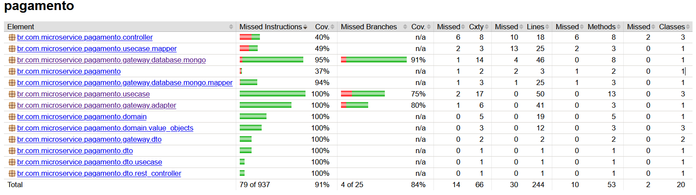

# Tech Challenge 04 - Pagamento

Microsserviço de pagamento utilizando arquitetura limpa. Este projeto é parte do Tech Challenge 04 da pós-graduação de `Arquitetura e Desenvolvimento Java` na instituição FIAP.

***

## Introdução

Esta aplicação é um microsserviço de pagamento, desenvolvido com arquitetura limpa. Ele gerencia o ciclo de vida dos pagamentos, desde a solicitação até o processamento e a consulta do status.

O projeto pode ser acessado em: `https://github.com/joao-v170r/micro-pagamento-clean-arch`

***

## Funções

* **Solicitar Pagamento**: Permite iniciar um novo pagamento com diferentes métodos (PIX, Boleto).
* **Processar Pagamento**: Atualiza o status de um pagamento consultando um gateway externo.
* **Consultar Pagamento por ID**: Busca os detalhes de um pagamento específico.
* **Consultar Pagamento por ID do Pedido**: Busca os detalhes de um pagamento associado a um ID de pedido.
* **Listar Todos os Pagamentos**: Retorna uma lista paginada de todos os pagamentos registrados.

***

## Tecnologias

* **Spring Boot**: Framework web para construção de aplicações Java.
* **Maven**: Gerenciador de dependências e construção de projetos.
* **Swagger/Springdoc OpenAPI**: Para documentação e interface de testes da API.
* **MongoDB**: Banco de dados NoSQL utilizado para persistência dos dados de pagamento.
* **Docker / Docker Compose**: Para orquestração e execução dos serviços em contêineres.
* **Lombok**: Biblioteca para reduzir código boilerplate em Java.

***

## Instalação

* Certifique-se de ter o [Docker Desktop](https://www.docker.com/products/docker-desktop/) instalado.
* Baixe os arquivos do repositório. Você pode clonar o projeto utilizando: `git clone https://github.com/joao-v170r/micro-pagamento-clean-arch`.
* Entre na pasta raiz do repositório clonado: `cd micro-pagamento-clean-arch`.
* Execute o projeto com o Docker Compose.
  * Utilize este comando no terminal: `docker-compose up --build`.

Este `docker-compose` irá rodar o microsserviço Spring Boot (`pagamento-app`) na porta `8082` (mapeada para `8080` no container) com o banco de dados MongoDB (`mongodb-pagamento`) na porta `27019` (mapeada para `27017` no container).

O Swagger UI pode ser acessado diretamente em `http://localhost:8082/swagger-ui/index.html`.

***

## Banco de dados

A entidade principal no MongoDB é `Pagamento`.

| Campo             | Descrição                                                                         | Tipo                       |
| :---------------- | :-------------------------------------------------------------------------------- | :------------------------- |
| `id`              | Identificador único do pagamento                                                  | `String`                   |
| `pedidoId`        | ID do pedido associado ao pagamento (único)                                       | `String`                   |
| `valorTotal`      | Valor total do pagamento                                                          | `BigDecimal`               |
| `moedaPagamento`  | Moeda utilizada no pagamento (ex: BRL)                                           | `Enum (MoedaPagamento)`    |
| `metodoPagamento` | Método de pagamento (ex: PIX, BOLETO)                                             | `Enum (MetodoPagamento)`   |
| `gatewayPagamento`| Nome do gateway de pagamento utilizado                                            | `String`                   |
| `detalhes`        | Detalhes adicionais do pagamento (ex: QR Code, linha digitável)                   | `HashMap<String, String>`  |
| `status`          | Status atual do pagamento (PENDENTE, CONCLUIDO, CANCELADO, REEMBOLSADO)           | `Enum (StatusPagamento)`   |
| `dtCriacao`       | Data e hora da criação do registro de pagamento                                   | `LocalDateTime`            |
| `dtAtualizacao`   | Data e hora da última atualização do pagamento                                    | `LocalDateTime`            |
| `codGateway`      | Código de transação retornado pelo gateway de pagamento                           | `String`                   |

Um usuário com permissão de leitura e escrita (`cliente_micro` com senha `123_321`) é criado para o banco de dados `db_pagamento` durante a inicialização do MongoDB.

***

## API

### Pagamento

| Método | URL                                    | Ação                                                             |
| :----- | :------------------------------------- | :--------------------------------------------------------------- |
| `POST`   | `/solicita-pagamento`                  | Solicita um novo pagamento.                                      |
| `POST`   | `/processa-pagamento/{id}`             | Processa o pagamento e verifica a atualização no gateway externo. |
| `GET`    | `/pagamento/{id}`                      | Busca um pagamento pelo seu ID.                                  |
| `GET`    | `/pagamento/pedido/{pedidoId}`         | Busca um pagamento pelo ID do pedido associado.                  |
| `GET`    | `/pagamento`                           | Lista todos os pagamentos com opção de paginação.                |

### Exemplos de Requisição e Resposta

#### `POST /solicita-pagamento` - Solicitação de Pagamento

**Exemplo de Envio:**

```json
{
    "clienteId": "60d0fe4f3b14f52a7c4a1b00",
    "pedidoId": "60d0fe4f3b14f52a7c4a1b01",
    "metodoPagamento": "PIX",
    "valorTotal": 150.75
}
```
Exemplo de Resposta (Status 201 Created):

JSON
```json
{
    "id": "pagamento123",
    "pedidoId": "pedido123",
    "valorTotal": 100.0,
    "moedaPagamento": "BRL",
    "metodoPagamento": "PIX",
    "gatewayPagamento": "gateway",
    "detalhes": null,
    "status": "CONCLUIDO",
    "dtCriacao": "2024-05-21T23:00:00",
    "dtAtualizacao": "2024-05-21T23:00:00",
    "codGateway": "gateway"
}
```
Note: O id, dtCriacao, dtAtualizacao e codGateway são valores gerados dinamicamente e podem variar.

#### POST /processa-pagamento/{id} - Processar Pagamento
Exemplo de Envio (Path Variable):

id: 60d0fe4f3b14f52a7c4a1b02 (Exemplo de ID de um pagamento pendente)

Exemplo de Resposta (Status 200 OK):

JSON
```json
{
    "id": "60d0fe4f3b14f52a7c4a1b02",
    "pedidoId": "60d0fe4f3b14f52a7c4a1b01",
    "valorTotal": 150.75,
    "moedaPagamento": "BRL",
    "metodoPagamento": "PIX",
    "gatewayPagamento": "mercado_pago",
    "detalhes": {
        "qr_code": "data:image/png;base64",
        "codigo_copia_cola": "00020126360014BR.GOV.BCB.PIX",
        "expiracao": "2025-05-24T14:30:00",
        "status": "PAGO"
    },
    "status": "CONCLUIDO",
    "dtCriacao": "2025-05-21T23:00:00.000000",
    "dtAtualizacao": "2025-05-21T23:05:00.000000",
    "codGateway": "PIX-UUID-DO-GATEWAY"
}
```
Note: O dtAtualizacao e o status CONCLUIDO refletem a atualização após o processamento.

#### GET /pagamento/{id} - Buscar Pagamento por ID
Exemplo de Envio (Path Variable):

id: 60d0fe4f3b14f52a7c4a1b02

Exemplo de Resposta (Status 200 OK):

JSON
```json
{
    "id": "60d0fe4f3b14f52a7c4a1b02",
    "pedidoId": "60d0fe4f3b14f52a7c4a1b01",
    "valorTotal": 150.75,
    "moedaPagamento": "BRL",
    "metodoPagamento": "PIX",
    "gatewayPagamento": "mercado_pago",
    "detalhes": {
        "qr_code": "data:image/png;base64",
        "codigo_copia_cola": "00020126360014BR.GOV.BCB.PIX",
        "expiracao": "2025-05-24T14:30:00"
    },
    "status": "PENDENTE",
    "dtCriacao": "2025-05-21T23:00:00.000000",
    "dtAtualizacao": null,
    "codGateway": "PIX-UUID-DO-GATEWAY"
}
```
#### GET /pagamento/pedido/{pedidoId} - Buscar Pagamento por ID do Pedido
Exemplo de Envio (Path Variable):

pedidoId: 60d0fe4f3b14f52a7c4a1b01

Exemplo de Resposta (Status 200 OK):

JSON

```json
{
    "id": "60d0fe4f3b14f52a7c4a1b02",
    "pedidoId": "60d0fe4f3b14f52a7c4a1b01",
    "valorTotal": 150.75,
    "moedaPagamento": "BRL",
    "metodoPagamento": "PIX",
    "gatewayPagamento": "mercado_pago",
    "detalhes": {
        "qr_code": "data:image/png;base64",
        "codigo_copia_cola": "00020126360014BR.GOV.BCB.PIX",
        "expiracao": "2025-05-24T14:30:00"
    },
    "status": "PENDENTE",
    "dtCriacao": "2025-05-21T23:00:00.000000",
    "dtAtualizacao": null,
    "codGateway": "PIX-UUID-DO-GATEWAY"
}
```
#### GET /pagamento - Listar Todos os Pagamentos
Exemplo de Envio (Query Parameters - Opcional):

page: 0 (padrão 0)
size: 10 (padrão 10)
sort: id (padrão id)

Exemplo de Resposta (Status 200 OK):

JSON
```json
[
    {
        "id": "60d0fe4f3b14f52a7c4a1b02",
        "pedidoId": "60d0fe4f3b14f52a7c4a1b01",
        "valorTotal": 150.75,
        "moedaPagamento": "BRL",
        "metodoPagamento": "PIX",
        "gatewayPagamento": "mercado_pago",
        "detalhes": {
            "qr_code": "data:image/png;base64",
            "codigo_copia_cola": "00020126360014BR.GOV.BCB.PIX",
            "expiracao": "2025-05-24T14:30:00"
        },
        "status": "PENDENTE",
        "dtCriacao": "2025-05-21T23:00:00.000000",
        "dtAtualizacao": null,
        "codGateway": "PIX-UUID-DO-GATEWAY"
    },
    {
        "id": "60d0fe4f3b14f52a7c4a1b03",
        "pedidoId": "60d0fe4f3b14f52a7c4a1b04",
        "valorTotal": 250.00,
        "moedaPagamento": "BRL",
        "metodoPagamento": "BOLETO",
        "gatewayPagamento": "mercado_pago",
        "detalhes": {
            "linha_digitavel": "34191.79001 01043.510047 91020.150008 7 84460000002000",
            "vencimento": "2025-05-27"
        },
        "status": "PENDENTE",
        "dtCriacao": "2025-05-21T23:10:00.000000",
        "dtAtualizacao": null,
        "codGateway": "BOLETO-UUID-DO-GATEWAY"
    }
]
```

***

## Qualidade de software

### Testes

Foi realizado testes na API, buscando alcançar mais de 80% de cobertura

<div align="center">
    
</div>
